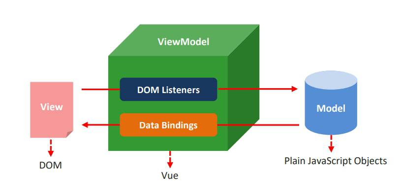

### 增加写Vue体验的vscode插件
* vetur
* vue 2 snippets
* one dark pro
* prettier-code formattor		格式化

### 设计思想
1. mvc
	* 后端架构思想
2. mvvc
	* 前端架构思想
		* m : `model`
			* 数据层 **Vue**中 数据层都放在data中
		* v : `view`视图
			* **Vue**中`view`即我们的HTML页面
		* vm : `view-model` 控制器 将数据和视图建立关系
			* `vm`即 **Vue** 的实例 就是 vm




### vue基础语法参数
> 语法 ： new Vue({参数：value})
```
el 				//挂载，关联
data 			//模型数据（值是一个对象）
methods 	※	//存放函数（值是一个对象）；无缓存
computed 	※	//计算属性，存放函数（值是一个对象）;让模板变得更加简单；有缓存
watch			//侦听器;存放函数（值是一个对象）；函数名为要监听的吧变量名；函数第一个形参为输入的值
directives		//局部自定义指令
filters			//局部过滤器
{{ }} 			//插值表达式，将数据填充在页面，支持一些js计算
```
> ※ 注意事项
* `methods` 和 `computed` 的区别
	1. 使用的时候`computed`不需要加()
	2. 是否缓存：计算属性是基于它们的依赖进行缓存的；_通俗点说：数据（依赖）没有改变时，计算同样的结果没有必要计算两次_	

	
### 指令
>注意：指令的本质是自定义属性

|指令											|作用											|  有无参数							|
|-- |-- | -- |
|v-cloak										|解决编译闪动；不常用							|      无							|
|v-text											|同{{}}作用,不解析html标签						| 有								|
|v-html											|同{{}}作用,解析html标签，容易遭受xss攻击		|  有								|
|v-pre											|阻止解析后面的{{msg}}，不常用					|  无								|
|v-once											|不在监听此数据，提高性能，不常用				|无									|
|v-model	※									|数据双向绑定									|有									|
|v-on:事件 = "fun"	※					| 绑定事件；简写：`@事件 = "事件"`;fun可以带()	| 有								|
|v-bind:属性 = "value"							| 绑定属性；简写：`:属性= "value"`				| 有,参数可为数组/对象；**自己体会**|
|v-if="条件"		※						| 满足判断条件，显示所在标签					| 有								|
|v-else="条件"									| 满足判断条件，显示所在标签					| 无								|
|v-else-if="条件"								| 满足判断条件，显示所在标签					| 有								|
|v-show="条件"	※						| 控制元素样式是否显示；相当于更改display		| 有								|
|v-for="(value,index) in 数组" :key="value.id" 	※	| 遍历数组;一定要加:key=>提高效率				| 有								|
|v-for="(value,key,index) in 对象"				| 遍历对象						| 有								|

>  ※  注意事项	
* v-model : 限制在`<input>`、`<select>`、`<textarea>`、`components`（组件）中使用
	
	--------------------------------------------------
	>语法：v-model.表单修饰符
	
	|表单修饰符	|作用						|
	|--|--|
	|number		|转化为数值					|
	|trim		|去掉开始和结尾的空格		|
	|lazy		|将input事件切换为change事件|


* v-on:事件="fun" 
	1. 当fun不带()时，函数中的第一个形参传回当前事件对象
	2. 当fun带()时，函数中有一个 **固定的实参** `$event`代表当前事件对象；`$event.target`是dom对象
	--------------------------------------------------
	>语法：v-on:事件.事件修饰符	
	
	|事件修饰符	|作用			|
	|-- |-- |
	|stop		|阻止冒泡		|
	|prevent	|阻止默认行为	|
	
	>注意事项
	
	1. 修饰符可以串联
	2. 事件后面有修饰符的时候可以不加参数
	--------------------------------------------------
	>语法：：v-on:键盘事件.按键修饰符	
	
	|按键修饰符	|作用				|
	|-- |-- |
	|enter		|按下回车			|
	|delete		|按下delete删除键	|
	|其他请参考vue官网		|[vue按键修饰符点此跳转](https://cn.vuejs.org/v2/guide/events.html#%E6%8C%89%E9%94%AE%E4%BF%AE%E9%A5%B0%E7%AC%A6)	|
	
	```js
	//自定义键盘修饰符，名字自定义，但是对应的值要对应键盘码(e.keyCode)的值
	Vue.config.keyCodes.fl = 112
	//获取键盘码
	methods:{
		fun(e){
			console.log(e.keyCode)
		}
	}
	```
	```html
	<!-- 快捷写法 -->
	<input type="text" @keydown.35="fun" v-model="age">
	```
	
* `v-if` 和 `v-show`的区别
	1. `v-if`控制元素是否渲染到页面
	2. `v-show`控制原始是否显示（已经渲染到页面）

* `v-for`中key的作用
	
	1. key属性可以用来提升v-for渲染的效率！，vue不会去改变原有的元素和数据，而是创建新的元素然后把新的数据渲染进去
###  什么是双向数据绑定？
>实现双向绑定的指令是`v-model`
```
当数据发生变化的时候，视图也就发生变化
当视图发生变化的时候，数据也会跟着同步变化
```
```html
<!-- 双向绑定原理代码 -->
<input v-bind:value="msg" @input="msg=$event.target.value" />
```

### 自定义指令
[官网CV它不香吗？](https://cn.vuejs.org/v2/guide/custom-directive.html#ad)

```js
//cv =>复制粘贴
// 注册一个全局自定义指令 `v-focus`
Vue.directive('focus', {
  // 当被绑定的元素插入到 DOM 中时……
  inserted: function (el) {
    // 聚焦元素
    el.focus()
  }
})
// 注册一个局部自定义指令 `v-focus`
directives: {
  focus: {
    // 指令的定义
    inserted: function (el) {
      el.focus()
    }
  }
}
```


### 过滤器
[官网CV它不香吗？](https://cn.vuejs.org/v2/guide/filters.html#ad)

```html
<!-- cv =>复制粘贴 -->
<!-- 在双花括号中; | : “管道”符号 -->
{{ message | capitalize }}

<!-- 在 `v-bind` 中 -->
<div v-bind:id="rawId | formatId"></div>
```

```js
// 注册一个全局过滤器 
Vue.filter('capitalize', function (value) {
	if (!value) return ''
	value = value.toString()
	return value.charAt(0).toUpperCase() + value.slice(1)
})

// 注册一个局部过滤器 
filters: {
	capitalize: function (value) {
		if (!value) return ''
		value = value.toString()
		return value.charAt(0).toUpperCase() + value.slice(1)
  }
}
```
--------------------------------------------------

### vue进阶=>[组件](https://cn.vuejs.org/v2/guide/components.html#ad)
>以下笔记不在写的非常详细，学会查看官方文档；下方将带一脚重要知识点
### 父组件向子组件传值
* 属性绑定
	1. 在`自定义`组件标签上绑定`自定义`属性
	2. 给此属性赋予值(静态/动态)
	3. 这个值通过`props`捕捉到
	4. `props`属性的参数可以是数组，捕获多个`自定义`属性
	5. 将捕获到的属性传入`template`中
	6. 注意`自定义`属性不建议`驼峰命名法`
### 子组件向父组件传值

> 待定